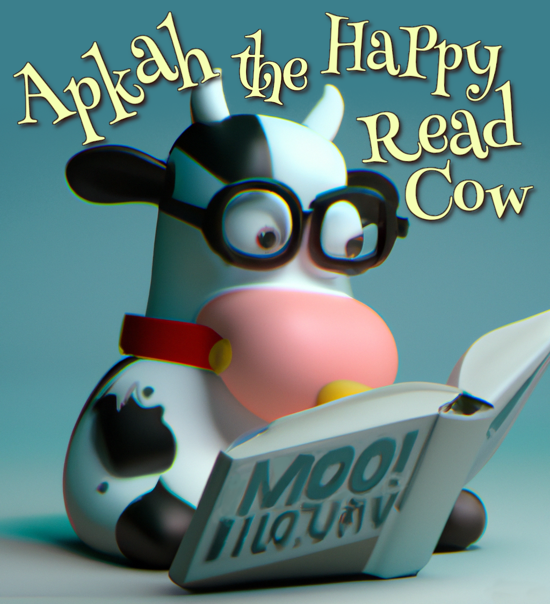
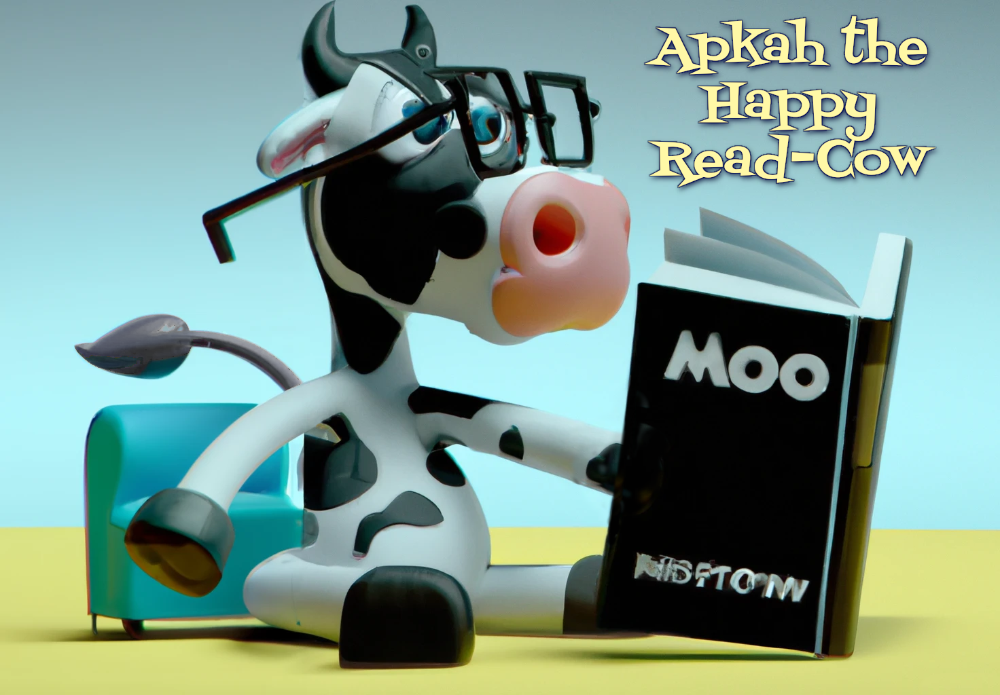

# ARC • APCA Readability Criterion
***APCA Guidelines for Readable Design***

**ARC is a set of guidelines & standards for visual content for use with the APCA contrast algorithm for creating accessible and readable designs of content.**

This repo is used for staging and testing the content prior to publishing on the live site. The current published draft version is:

## http://readtech.org/ARC/

While officially, ARC stands for *"APCA Readability Criterion"*, it *could* easily mean one of the following:

- Accessible, Readable Content
- APCA: Reading's Clever
- APCA Readability Contrast
- Almond Reading Cookies
- **Apkah** _the_ **Reading Cow**

### _Apkah the Happy Reading Cow_

 

-----

[Staging Draft](https://a11yreadtech.github.io/ARC/)
