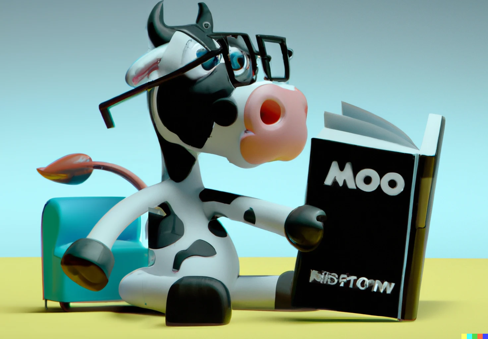

# ARC • APCA Readability Criterion
***APCA Guidelines for Readable Design***

**ARC is a set of guidelines & standards for visual content for use with the APCA contrast algorithm for creating accessible and readable designs of content.**

## http://readtech.org

While officially, ARC stands for *"APCA Readability Criterion"*, it *could* easily mean one of the following:

- Accessible, Readable Content
- APCA: Reading's Clever
- APCA Readability Contrast
- Almond Reading Cookies
- **APy** _the_ **Reading Cow**

     

